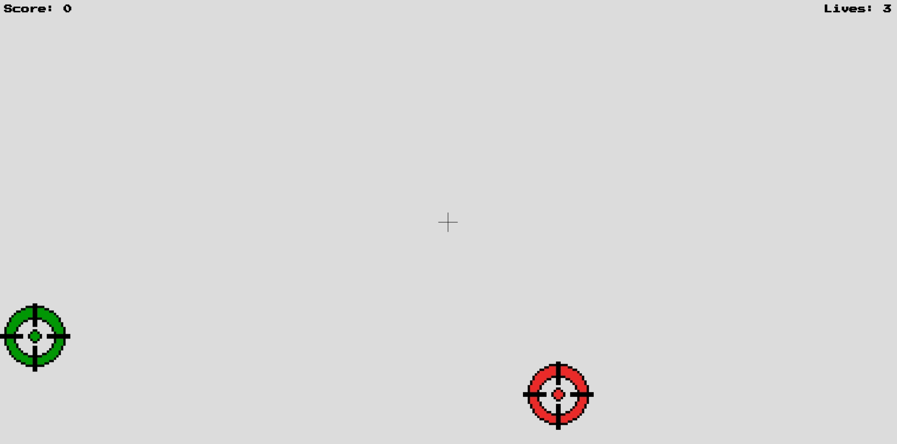

# Target Tapper

The game Target Tapper has a simple objective, tap as many neutral targets as possible, avoid damage targets, and tap health targets to gain lives. 

## Outline

- [Sprites](#sprites)
    - [Neutral Targets](#neutral-targets)
    - [Damage Targets](#damage-targets)
    - [Health Targets](#health-targets)
    - [Cross Hair](#cross-hair)
- [Mechanics](#mechanics)
    - [Lives](#lives)
    - [Score](#score)
- [Setup](#setup)
    - [Sound](#sound)
    - [Hardware](#hardware)
- [Plans](#plans)
- [Demo](#demo)

## Sprites

### Neutral Targets

Neutral targets are represented by yellow targets comparable to those in archery.

When a target is tapped, a point is gained.

### Damage Targets

Damage targets are identical to neutral targets except they have red color fill.

When a damage target is tapped 1 life is lost. 

### Health Targets

Health Targets are identical on differing in their green color fill.

Each tapped health target gains 1 life.

### Cross Hair

The cross hair is created by drawing lines in p5. The user controls the movement of the crosshair to tap the targets.

## Mechanics

### Lives

The player starts with 3 lives. When a damage target is tapped or the player misses an intended target (i.e hits nothing) they lose 1 life. A life can be regained by hitting a health target. The number of lives cannot exceed 3.

### Score

When a neutral target is tapped the score increases by 1. The objective of the game is to get the highest score without losing all lives. The game progressively becomes more difficult as the score increases by speeding up. 

## Setup

### Sound

There are many different sounds throughout the game. In the start screen there is a synthesized "start" sound. In the play stage there is a synthesized "background" music. Finally, the end screen has its own synthesized sound.
Within the play state there is also sound for hitting targets and missing them.  

### Hardware

A joystick is used to control the crosshair to tap the targets, to tap simply press down on the joystick. 
A buzzer is also used to indicate targets being tapped.
Two leds, a green and red, are used to respectively differentiate between a successful point gain or life loss.

## Plans

The game could benefit from future additions for more sound for each individual action ie. different sounds for each individual target type.
An optional timer could be added to be enabled by the player to add more difficulty. 

## Demo
[Target Tapper Demo](https://youtube.com/shorts/wxP-OFvDuvo)